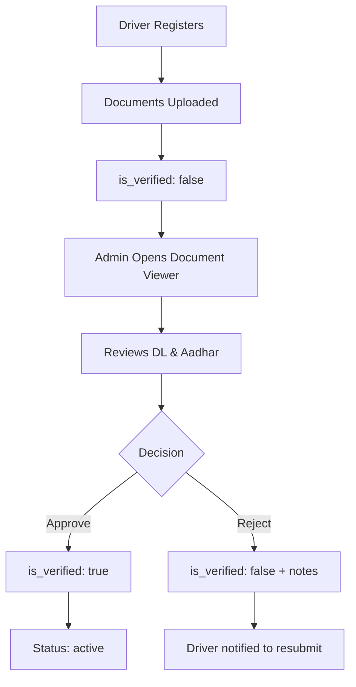

# 🔐 Driver Verification Feature - Complete Implementation

## Overview
Complete document verification system for drivers with admin review and approval workflow.

## ✅ What Was Implemented

### 1. Backend API Endpoints (`backend/app/api/v1/endpoints/admin.py`)

#### **PUT `/admin/users/{user_id}/verify`**
- Verify or reject driver documents
- Parameters:
  - `is_verified`: boolean (true = approve, false = reject)
  - `verification_notes`: optional string (required for rejection)
- Auto-updates status to "active" when verified
- Returns updated user object

#### **GET `/admin/users/{user_id}/documents`**
- Retrieve all uploaded documents for a user
- Returns:
  - User details (name, mobile, DL number, Aadhar number)
  - Document file IDs and metadata
  - Current verification status and notes

### 2. Frontend API Client (`frontend/src/lib/api.ts`)

Added to `adminAPI`:
```typescript
verifyDriver(id, isVerified, notes?) // Verify/reject driver
getUserDocuments(id)                  // Get user documents
```

### 3. DocumentViewerModal Component (`frontend/src/components/DocumentViewerModal.tsx`)

**Features:**
- 📄 **Document Display**: Shows all uploaded documents (DL & Aadhar, front/back)
- 🖼️ **Image Viewer**: High-quality image display with loading states
- ✅ **Verification Actions**: Approve or Reject buttons
- 📝 **Notes Field**: Add verification notes (required for rejection)
- 🔒 **Security**: Uses authenticated image URLs
- ⚡ **Real-time Updates**: Refreshes data after verification

**UI Layout:**
```
┌─────────────────────────────────────┐
│  Document Verification              │
│  Driver Name • Mobile Number        │
├─────────────────────────────────────┤
│  Current Status: Verified/Pending   │
│  DL: XXX | Aadhar: XXX             │
├─────────────────────────────────────┤
│  ┌──────────┐  ┌──────────┐        │
│  │ DL Front │  │ Aadhar   │        │
│  │  Image   │  │  Front   │        │
│  └──────────┘  └──────────┘        │
│  ┌──────────┐  ┌──────────┐        │
│  │ DL Back  │  │ Aadhar   │        │
│  │  Image   │  │  Back    │        │
│  └──────────┘  └──────────┘        │
├─────────────────────────────────────┤
│  Verification Notes:                │
│  [Text area for notes]              │
├─────────────────────────────────────┤
│  [Verify & Approve] [Reject Docs]  │
└─────────────────────────────────────┘
```

### 4. Driver Management Page Updates (`frontend/src/pages/admin/Drivers.tsx`)

**New Features:**
- 🔘 **Verification Button**: Each driver card has a verification button
  - Green if verified: "View Verified Documents"
  - Orange if pending: "Review & Verify Documents"
- 📊 **Visual Status**: Shows verification status inline
- 🎯 **Quick Access**: One-click to open document viewer

## 🔄 Verification Workflow



## 📋 User Journey

### Admin Workflow:
1. Navigate to **Driver Management**
2. See drivers with verification status
3. Click **"Review & Verify Documents"** button
4. **Document Viewer Modal** opens showing:
   - All uploaded documents
   - Driver details
   - Current verification status
5. Review documents carefully
6. Add notes (optional for approval, required for rejection)
7. Click **"Verify & Approve"** or **"Reject Documents"**
8. Confirmation dialog appears
9. System updates verification status
10. Driver list refreshes automatically

### Driver Experience:
- **Pending**: ⏳ Shows "Pending Verification"
- **Verified**: ✅ Shows "Verified" - can start working
- **Rejected**: ❌ Can see rejection notes and resubmit

## 🎨 UI Features

### Verification Status Indicators:
- ✅ **Verified**: Green badge with checkmark
- ⏳ **Pending**: Orange badge with clock icon
- ❌ **Rejected**: Red badge with X icon

### Action Buttons:
- **Verify & Approve**: Green button with CheckCircle icon
- **Reject Documents**: Red button with XCircle icon
- **View Documents**: Blue/Orange button with FileText icon

### Visual Feedback:
- Loading spinners during image load
- Toast notifications for success/error
- Confirmation dialogs for actions
- Disabled states during processing

## 🔒 Security & Permissions

### Backend:
- ✅ Requires admin authentication (`get_current_admin_user`)
- ✅ Validates user existence
- ✅ Validates status codes
- ✅ Logs verification actions

### Frontend:
- ✅ Authenticated image URLs
- ✅ Protected routes (admin only)
- ✅ Secure file access via tokens

## 📊 Database Updates

### User Document Schema:
```json
{
  "_id": "ObjectId",
  "mobile_number": "string",
  "full_name": "string",
  "is_verified": false,           // ← Verification status
  "verification_notes": "string", // ← Admin notes
  "status": "registered",         // ← Auto-updated on verify
  "documents": {
    "dl_front": "file_id",
    "dl_back": "file_id",
    "aadhar_front": "file_id",
    "aadhar_back": "file_id"
  }
}
```

## 🚀 How to Use

### For Admins:
1. Go to **Driver Management** page
2. Find driver with "⏳ Pending" verification
3. Click **"Review & Verify Documents"**
4. Review all documents carefully
5. Add notes if needed
6. Click **"Verify & Approve"** to approve
   - OR -
7. Add rejection reason and click **"Reject Documents"**

### For Developers:
```bash
# Backend is ready - no restart needed if using --reload
# Frontend will hot-reload automatically

# Test the endpoints:
curl -X PUT http://localhost:8000/api/v1/admin/users/{user_id}/verify \
  -H "Authorization: Bearer {token}" \
  -d "is_verified=true"

curl -X GET http://localhost:8000/api/v1/admin/users/{user_id}/documents \
  -H "Authorization: Bearer {token}"
```

## 🎯 Key Benefits

1. **Streamlined Process**: One-click access to all documents
2. **Better UX**: Visual document viewer with zoom capability
3. **Audit Trail**: Verification notes stored with timestamp
4. **Status Automation**: Auto-updates driver status on approval
5. **Error Prevention**: Required notes for rejection
6. **Real-time Updates**: Immediate UI refresh after actions

## 📝 Future Enhancements (Optional)

- [ ] Document zoom/pan functionality
- [ ] Side-by-side comparison view
- [ ] Bulk verification for multiple drivers
- [ ] Email notifications to drivers
- [ ] Document expiry tracking
- [ ] Re-verification workflow
- [ ] Verification history log
- [ ] Export verification reports

## ✨ Testing Checklist

- [x] Backend endpoints working
- [x] Frontend API integration
- [x] Document viewer modal displays correctly
- [x] Images load with authentication
- [x] Verify action updates status
- [x] Reject action requires notes
- [x] UI refreshes after actions
- [x] Error handling works
- [x] Loading states display
- [x] Confirmation dialogs appear

## 🎉 Status: COMPLETE

All features implemented and ready for use!

